  
 
 # EchoLens: ESP32-CAM based, AI powered Smart Glasses

## Presentation (in French):

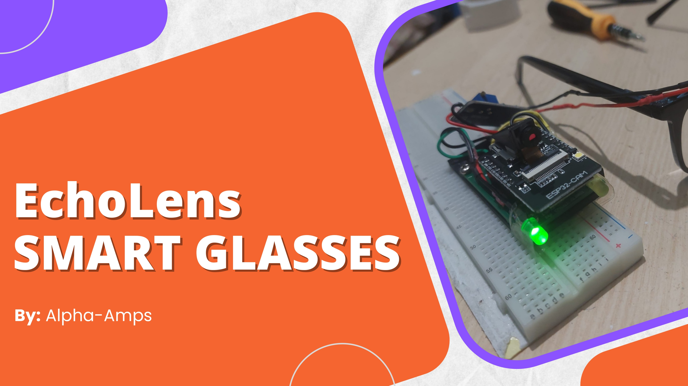
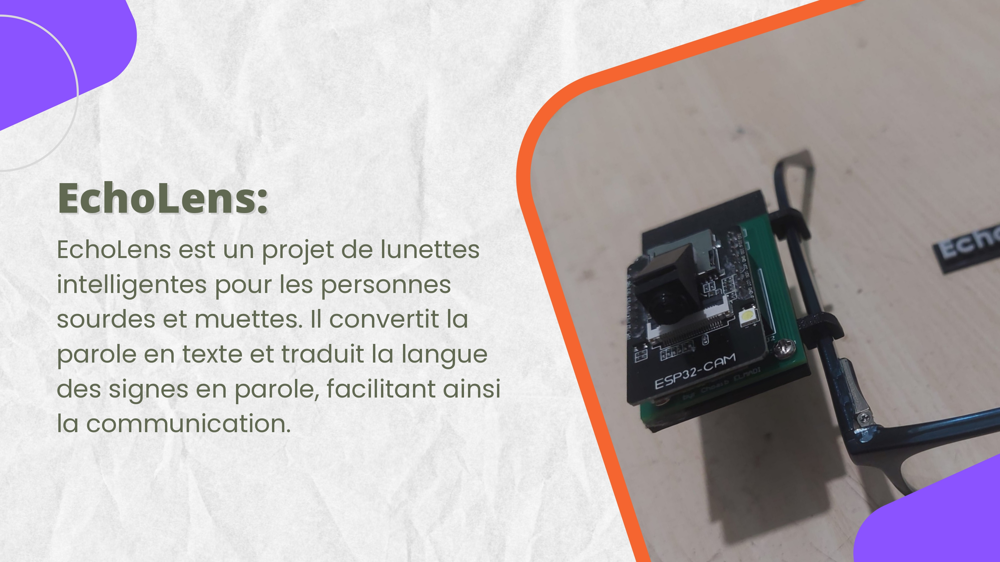
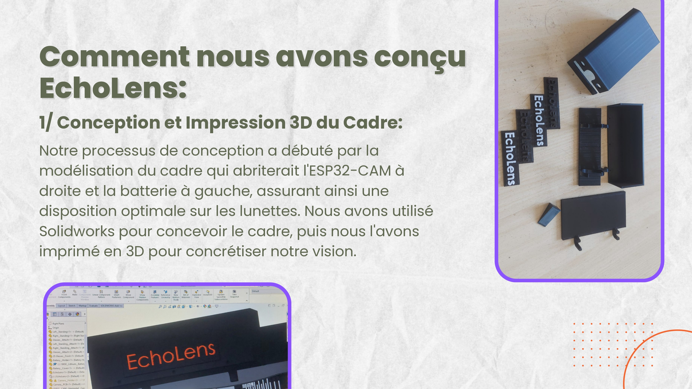
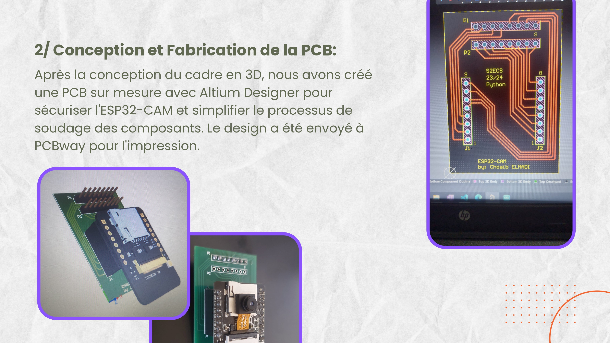
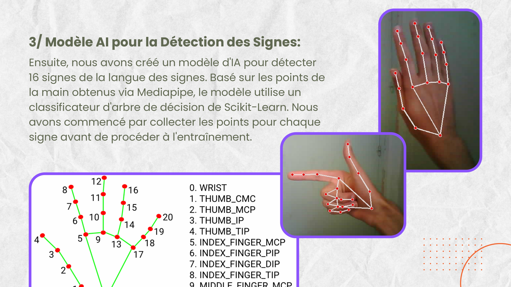
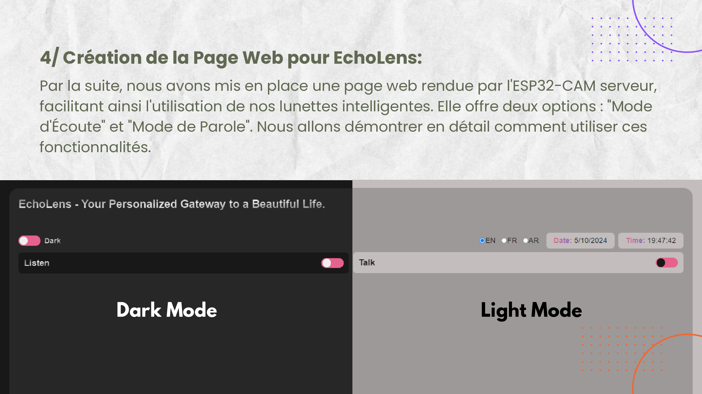
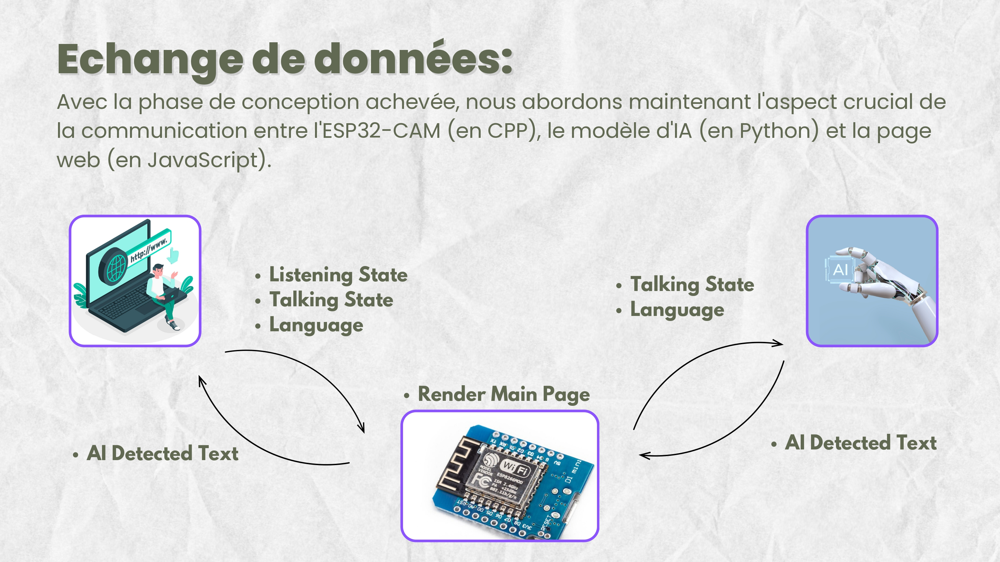
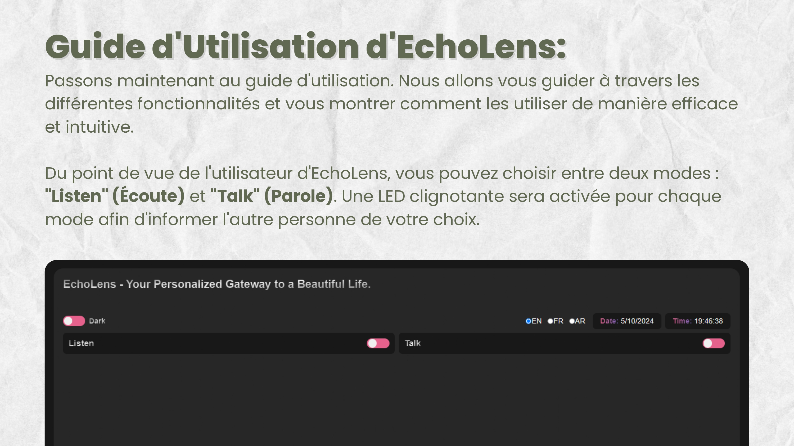
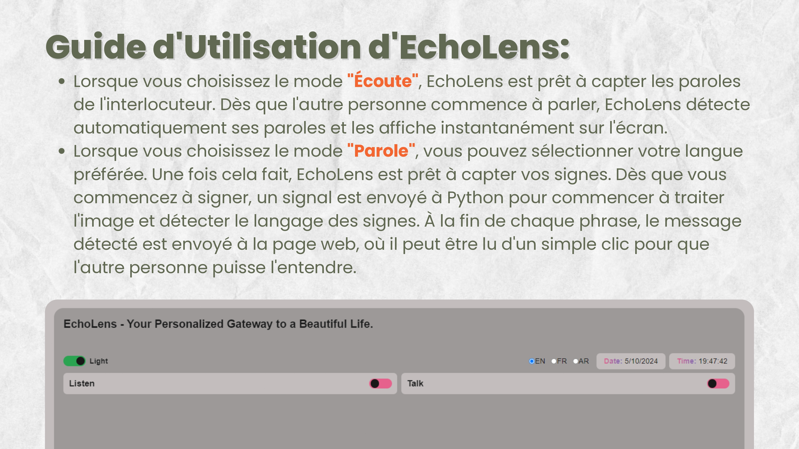
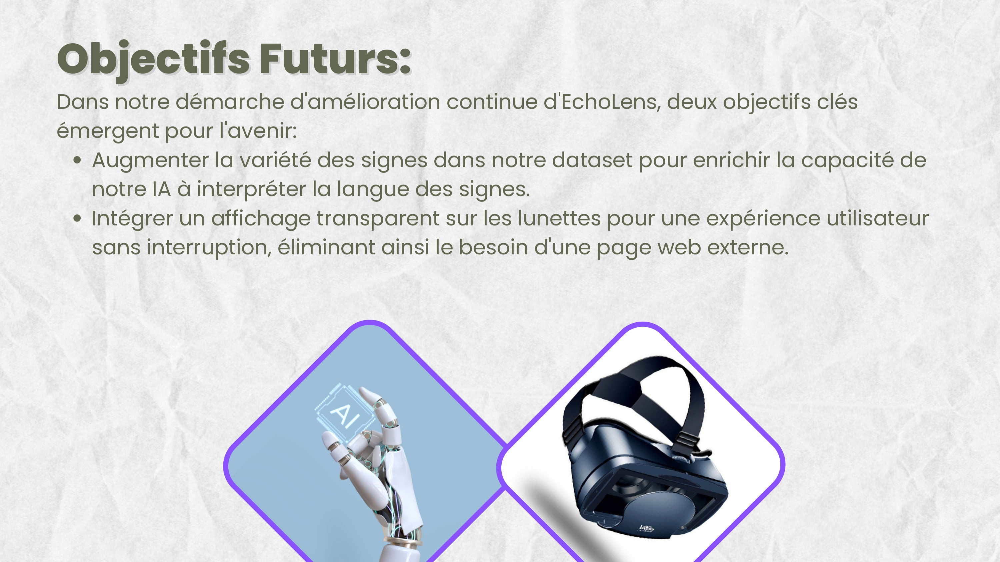
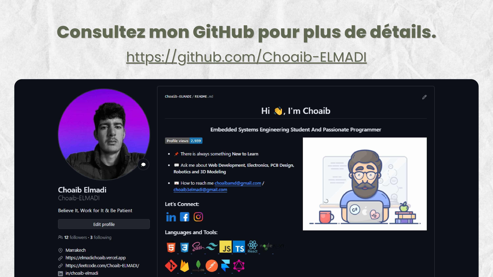
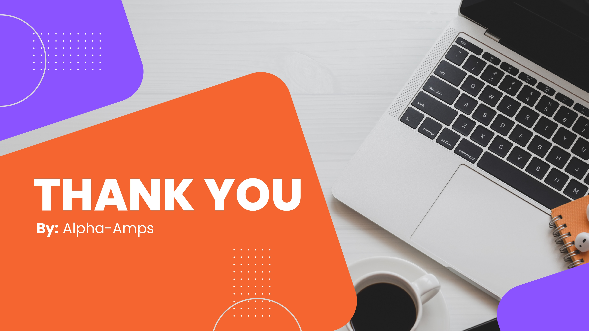

Special thanks to [Start ASL](https://www.startasl.com/) for providing free meanings for American Sign Language (ASL) signs used in our smart glasses project for the deaf community. Check their website for more details.

Please note that while we strive for accuracy, our sign interpretations may not be 100% correct. We appreciate your understanding.
